# React 시퀀스 다이어그램

## 목차

### 📌 기본과제 (Chapter 2-2 기본과제)
1. [기본 렌더링 플로우](#1-기본-렌더링-플로우)
2. [기본 훅 실행 플로우](#2-기본-훅-실행-플로우)
3. [Reconciliation 과정](#3-reconciliation-과정)
4. [이벤트 처리 플로우](#4-이벤트-처리-플로우)

### 🚀 심화과제 (Chapter 2-2 심화과제)
5. [고급 훅 플로우](#5-고급-훅-플로우)
6. [메모이제이션 플로우](#6-메모이제이션-플로우)
7. [HOC 플로우](#7-hoc-플로우)

## 📌 기본과제 시퀀스 다이어그램

## 1. 기본 렌더링 플로우

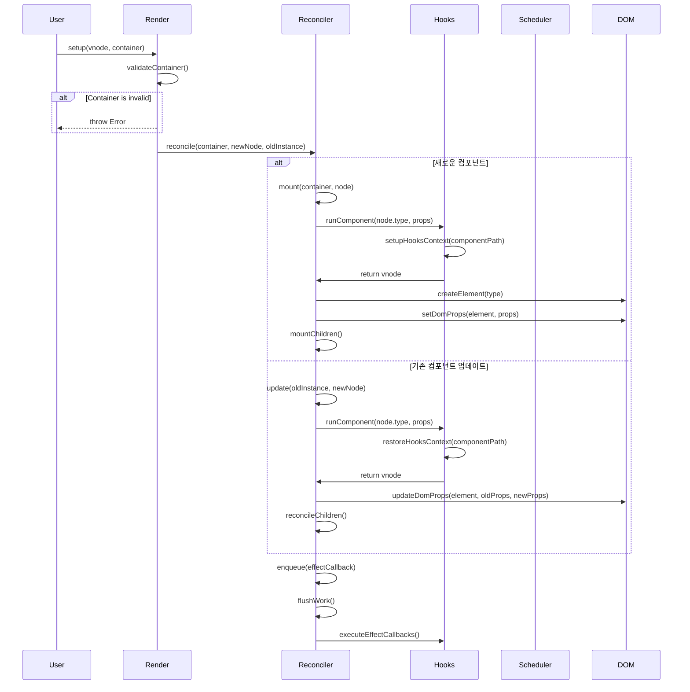
```mermaid
sequenceDiagram
    participant User
    participant Render
    participant Reconciler
    participant Hooks
    participant Scheduler
    participant DOM

    User->>Render: setup(vnode, container)
    Render->>Render: validateContainer()

    alt Container is invalid
        Render-->>User: throw Error
    end

    Render->>Reconciler: reconcile(container, newNode, oldInstance)

    alt 새로운 컴포넌트
        Reconciler->>Reconciler: mount(container, node)
        Reconciler->>Hooks: runComponent(node.type, props)
        Hooks->>Hooks: setupHooksContext(componentPath)
        Hooks->>Reconciler: return vnode
        Reconciler->>DOM: createElement(type)
        Reconciler->>DOM: setDomProps(element, props)
        Reconciler->>Reconciler: mountChildren()
    else 기존 컴포넌트 업데이트
        Reconciler->>Reconciler: update(oldInstance, newNode)
        Reconciler->>Hooks: runComponent(node.type, props)
        Hooks->>Hooks: restoreHooksContext(componentPath)
        Hooks->>Reconciler: return vnode
        Reconciler->>DOM: updateDomProps(element, oldProps, newProps)
        Reconciler->>Reconciler: reconcileChildren()
    end

    Reconciler->>Reconciler: enqueue(effectCallback)
    Reconciler->>Reconciler: flushWork()
    Reconciler->>Hooks: executeEffectCallbacks()
```

## 2. 기본 훅 실행 플로우

### 2.1 useState 상태 변경

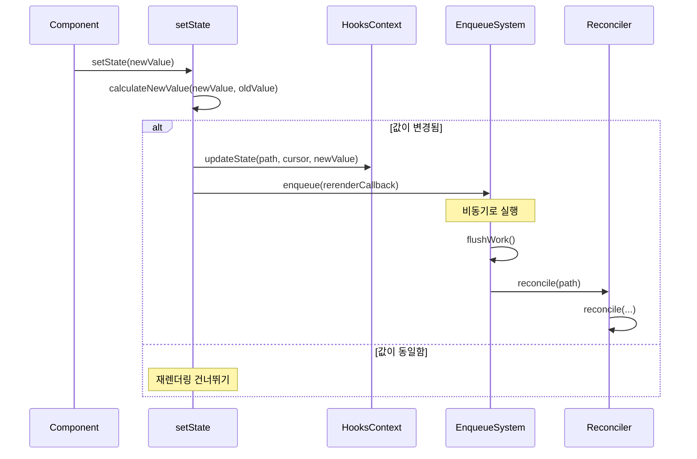
```mermaid
sequenceDiagram
    participant Component
    participant setState
    participant HooksContext
    participant EnqueueSystem
    participant Reconciler

    Component->>setState: setState(newValue)

    setState->>setState: calculateNewValue(newValue, oldValue)

    alt 값이 변경됨
        setState->>HooksContext: updateState(path, cursor, newValue)
        setState->>EnqueueSystem: enqueue(rerenderCallback)

        Note over EnqueueSystem: 비동기로 실행
        EnqueueSystem->>EnqueueSystem: flushWork()
        EnqueueSystem->>Reconciler: reconcile(path)
        Reconciler->>Reconciler: reconcile(...)
    else 값이 동일함
        Note over setState: 재렌더링 건너뛰기
    end
```

### 2.2 useEffect 실행

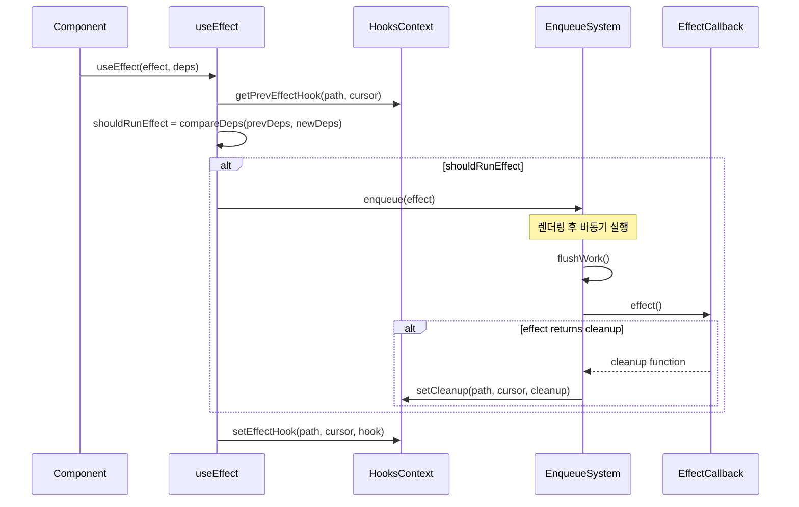
```mermaid
sequenceDiagram
    participant Component
    participant useEffect
    participant HooksContext
    participant EnqueueSystem
    participant EffectCallback

    Component->>useEffect: useEffect(effect, deps)

    useEffect->>HooksContext: getPrevEffectHook(path, cursor)

    useEffect->>useEffect: shouldRunEffect = compareDeps(prevDeps, newDeps)

    alt shouldRunEffect
        useEffect->>EnqueueSystem: enqueue(effect)

        Note over EnqueueSystem: 렌더링 후 비동기 실행
        EnqueueSystem->>EnqueueSystem: flushWork()
        EnqueueSystem->>EffectCallback: effect()

        alt effect returns cleanup
            EffectCallback-->>EnqueueSystem: cleanup function
            EnqueueSystem->>HooksContext: setCleanup(path, cursor, cleanup)
        end
    end

    useEffect->>HooksContext: setEffectHook(path, cursor, hook)
```

## 3. Reconciliation 과정

### 3.1 기본 Reconciliation

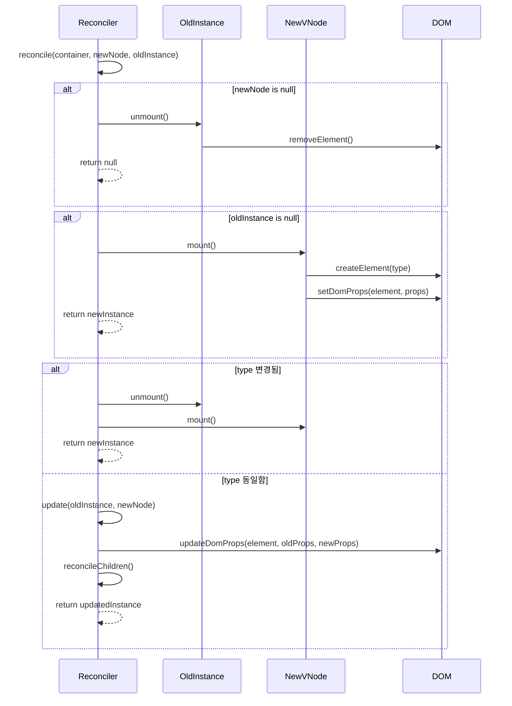
```mermaid
sequenceDiagram
    participant Reconciler
    participant OldInstance
    participant NewVNode
    participant DOM

    Reconciler->>Reconciler: reconcile(container, newNode, oldInstance)

    alt newNode is null
        Reconciler->>OldInstance: unmount()
        OldInstance->>DOM: removeElement()
        Reconciler-->>Reconciler: return null
    end

    alt oldInstance is null
        Reconciler->>NewVNode: mount()
        NewVNode->>DOM: createElement(type)
        NewVNode->>DOM: setDomProps(element, props)
        Reconciler-->>Reconciler: return newInstance
    end

    alt type 변경됨
        Reconciler->>OldInstance: unmount()
        Reconciler->>NewVNode: mount()
        Reconciler-->>Reconciler: return newInstance
    else type 동일함
        Reconciler->>Reconciler: update(oldInstance, newNode)
        Reconciler->>DOM: updateDomProps(element, oldProps, newProps)
        Reconciler->>Reconciler: reconcileChildren()
        Reconciler-->>Reconciler: return updatedInstance
    end
```

### 3.2 자식 노드 Reconciliation

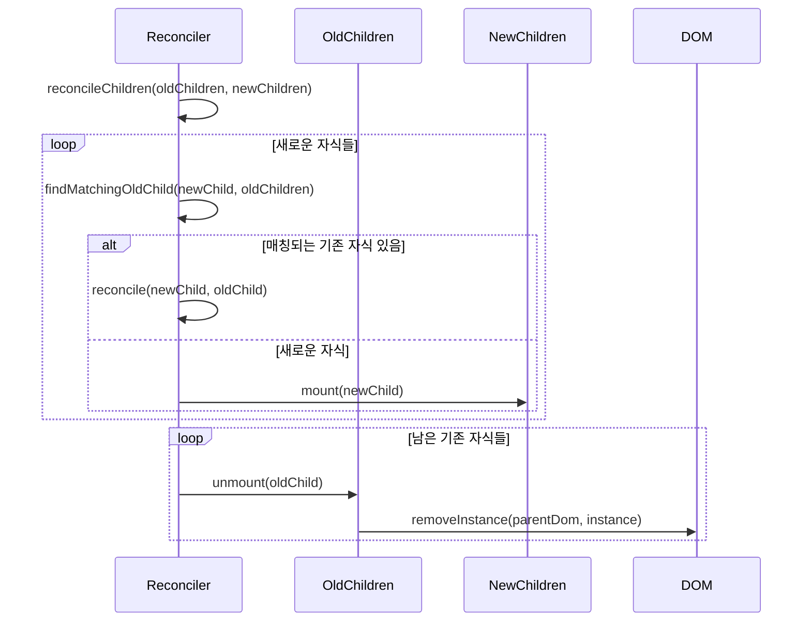
```mermaid
sequenceDiagram
    participant Reconciler
    participant OldChildren
    participant NewChildren
    participant DOM

    Reconciler->>Reconciler: reconcileChildren(oldChildren, newChildren)

    loop 새로운 자식들
        Reconciler->>Reconciler: findMatchingOldChild(newChild, oldChildren)

        alt 매칭되는 기존 자식 있음
            Reconciler->>Reconciler: reconcile(newChild, oldChild)
        else 새로운 자식
            Reconciler->>NewChildren: mount(newChild)
        end
    end

    loop 남은 기존 자식들
        Reconciler->>OldChildren: unmount(oldChild)
        OldChildren->>DOM: removeInstance(parentDom, instance)
    end
```

### 3.3 Key 기반 최적화

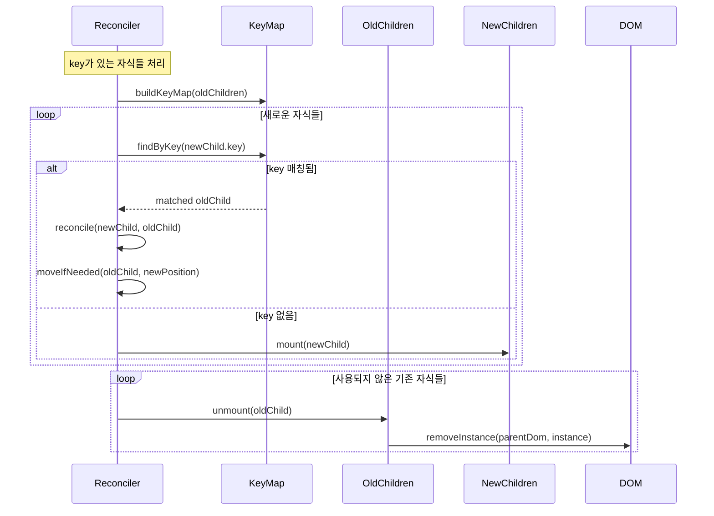
```mermaid
sequenceDiagram
    participant Reconciler
    participant KeyMap
    participant OldChildren
    participant NewChildren

    Note over Reconciler: key가 있는 자식들 처리

    Reconciler->>KeyMap: buildKeyMap(oldChildren)

    loop 새로운 자식들
        Reconciler->>KeyMap: findByKey(newChild.key)

        alt key 매칭됨
            KeyMap-->>Reconciler: matched oldChild
            Reconciler->>Reconciler: reconcile(newChild, oldChild)
            Reconciler->>Reconciler: moveIfNeeded(oldChild, newPosition)
        else key 없음
            Reconciler->>NewChildren: mount(newChild)
        end
    end

    loop 사용되지 않은 기존 자식들
        Reconciler->>OldChildren: unmount(oldChild)
        OldChildren->>DOM: removeInstance(parentDom, instance)
    end
```

## 4. 이벤트 처리 플로우

### 4.1 이벤트 핸들러 등록

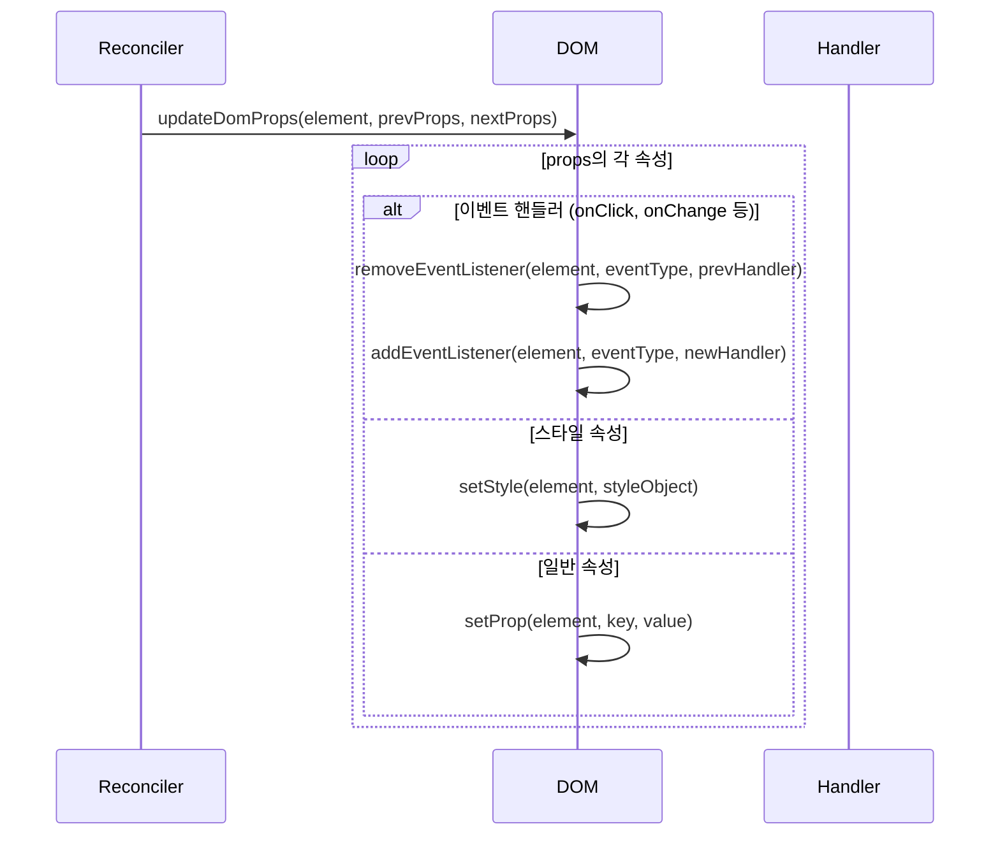
```mermaid
sequenceDiagram
    participant Reconciler
    participant DOM
    participant Handler

    Reconciler->>DOM: updateDomProps(element, prevProps, nextProps)

    loop props의 각 속성
        alt 이벤트 핸들러 (onClick, onChange 등)
            DOM->>DOM: removeEventListener(element, eventType, prevHandler)
            DOM->>DOM: addEventListener(element, eventType, newHandler)
        else 스타일 속성
            DOM->>DOM: setStyle(element, styleObject)
        else 일반 속성
            DOM->>DOM: setProp(element, key, value)
        end
    end
```

### 4.2 이벤트 발생 및 처리

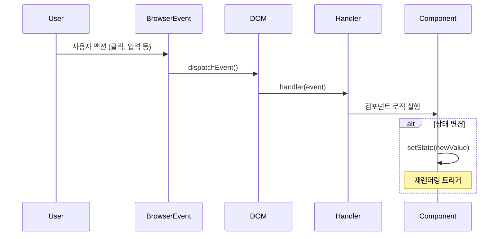
```mermaid
sequenceDiagram
    participant User
    participant BrowserEvent
    participant DOM
    participant Handler
    participant Component

    User->>BrowserEvent: 사용자 액션 (클릭, 입력 등)
    BrowserEvent->>DOM: dispatchEvent()
    DOM->>Handler: handler(event)

    Handler->>Component: 컴포넌트 로직 실행

    alt 상태 변경
        Component->>Component: setState(newValue)
        Note over Component: 재렌더링 트리거
    end
```

## 🚀 심화과제 시퀀스 다이어그램

## 5. 고급 훅 플로우

### 5.1 useMemo/useCallback 실행

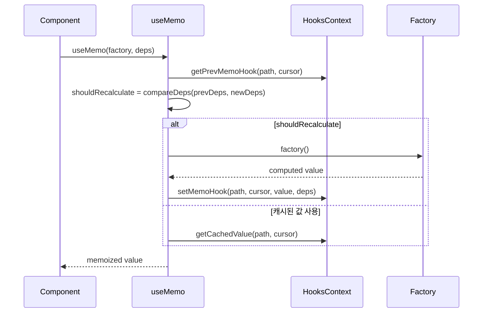
```mermaid
sequenceDiagram
    participant Component
    participant useMemo
    participant HooksContext
    participant Factory

    Component->>useMemo: useMemo(factory, deps)

    useMemo->>HooksContext: getPrevMemoHook(path, cursor)

    useMemo->>useMemo: shouldRecalculate = compareDeps(prevDeps, newDeps)

    alt shouldRecalculate
        useMemo->>Factory: factory()
        Factory-->>useMemo: computed value
        useMemo->>HooksContext: setMemoHook(path, cursor, value, deps)
    else 캐시된 값 사용
        useMemo->>HooksContext: getCachedValue(path, cursor)
    end

    useMemo-->>Component: memoized value
```

### 5.2 useRef 실행

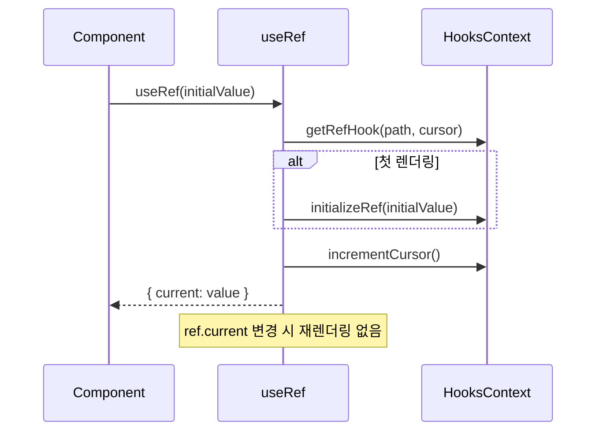
```mermaid
sequenceDiagram
    participant Component
    participant useRef
    participant HooksContext

    Component->>useRef: useRef(initialValue)

    useRef->>HooksContext: getRefHook(path, cursor)

    alt 첫 렌더링
        useRef->>HooksContext: initializeRef(initialValue)
    end

    useRef->>HooksContext: incrementCursor()
    useRef-->>Component: { current: value }

    Note over useRef: ref.current 변경 시 재렌더링 없음
```

### 5.3 useAutoCallback 실행

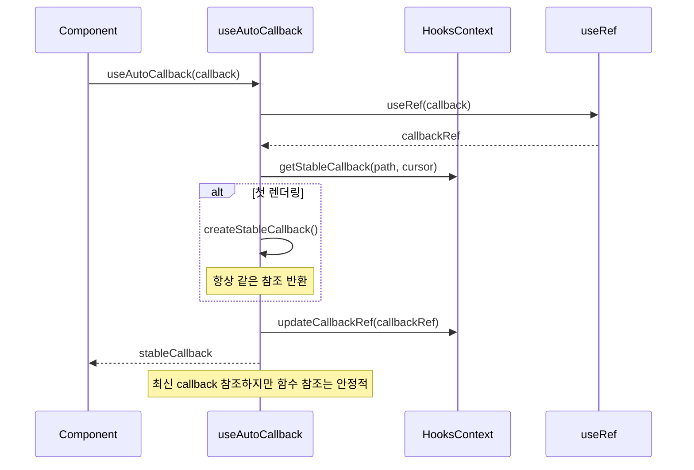
```mermaid
sequenceDiagram
    participant Component
    participant useAutoCallback
    participant HooksContext
    participant useRef

    Component->>useAutoCallback: useAutoCallback(callback)

    useAutoCallback->>useRef: useRef(callback)
    useRef-->>useAutoCallback: callbackRef

    useAutoCallback->>HooksContext: getStableCallback(path, cursor)

    alt 첫 렌더링
        useAutoCallback->>useAutoCallback: createStableCallback()
        Note over useAutoCallback: 항상 같은 참조 반환
    end

    useAutoCallback->>HooksContext: updateCallbackRef(callbackRef)
    useAutoCallback-->>Component: stableCallback

    Note over useAutoCallback: 최신 callback 참조하지만 함수 참조는 안정적
```

## 6. 메모이제이션 플로우

### 6.1 memo HOC

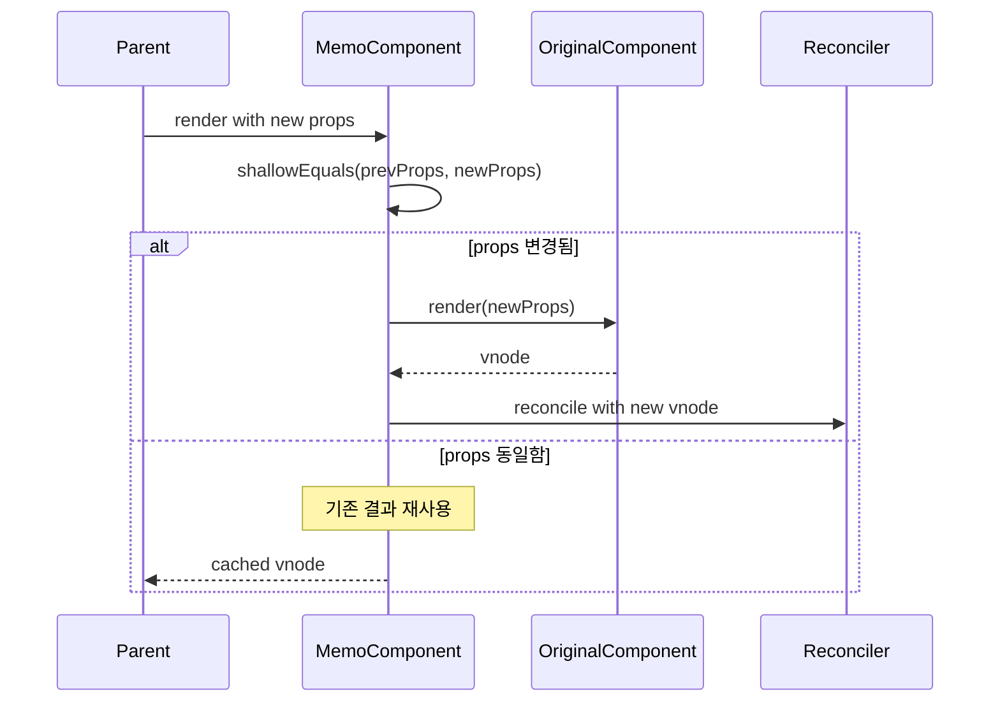
```mermaid
sequenceDiagram
    participant Parent
    participant MemoComponent
    participant OriginalComponent
    participant Reconciler

    Parent->>MemoComponent: render with new props

    MemoComponent->>MemoComponent: shallowEquals(prevProps, newProps)

    alt props 변경됨
        MemoComponent->>OriginalComponent: render(newProps)
        OriginalComponent-->>MemoComponent: vnode
        MemoComponent->>Reconciler: reconcile with new vnode
    else props 동일함
        Note over MemoComponent: 기존 결과 재사용
        MemoComponent-->>Parent: cached vnode
    end
```

### 6.2 deepMemo HOC

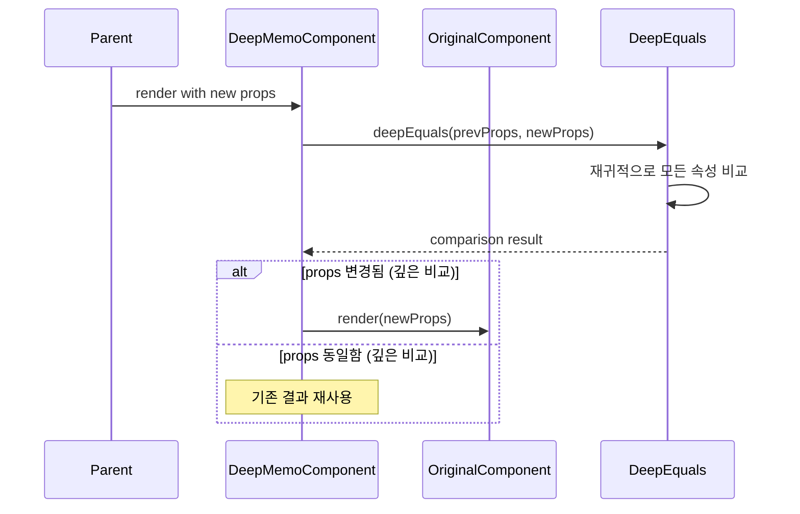
```mermaid
sequenceDiagram
    participant Parent
    participant DeepMemoComponent
    participant OriginalComponent
    participant DeepEquals

    Parent->>DeepMemoComponent: render with new props

    DeepMemoComponent->>DeepEquals: deepEquals(prevProps, newProps)
    DeepEquals->>DeepEquals: 재귀적으로 모든 속성 비교
    DeepEquals-->>DeepMemoComponent: comparison result

    alt props 변경됨 (깊은 비교)
        DeepMemoComponent->>OriginalComponent: render(newProps)
    else props 동일함 (깊은 비교)
        Note over DeepMemoComponent: 기존 결과 재사용
    end
```

## 7. HOC 플로우

### 7.1 컴포넌트 메모이제이션 과정

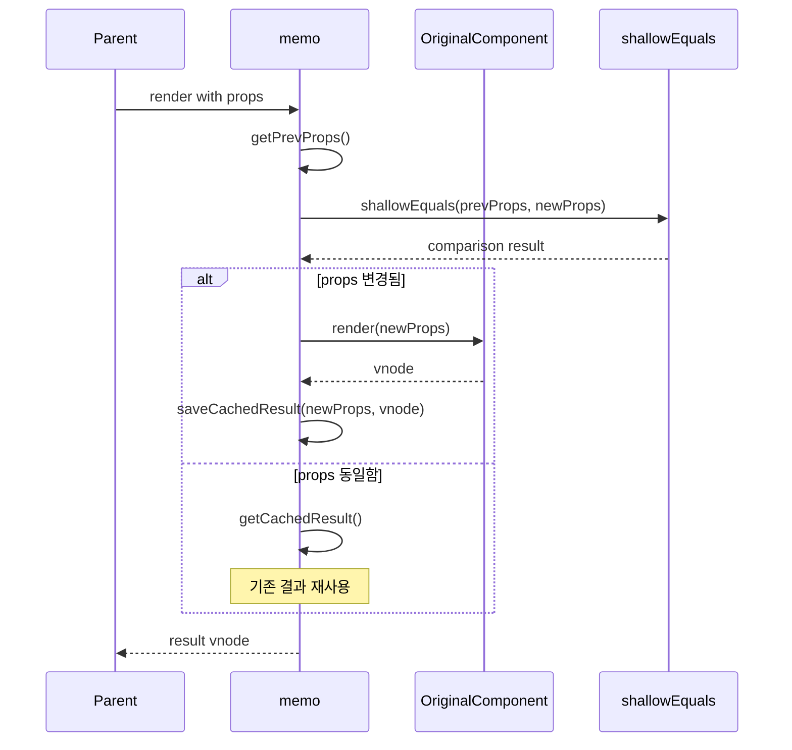
```mermaid
sequenceDiagram
    participant Parent
    participant memo
    participant OriginalComponent
    participant shallowEquals

    Parent->>memo: render with props

    memo->>memo: getPrevProps()
    memo->>shallowEquals: shallowEquals(prevProps, newProps)
    shallowEquals-->>memo: comparison result

    alt props 변경됨
        memo->>OriginalComponent: render(newProps)
        OriginalComponent-->>memo: vnode
        memo->>memo: saveCachedResult(newProps, vnode)
    else props 동일함
        memo->>memo: getCachedResult()
        Note over memo: 기존 결과 재사용
    end

    memo-->>Parent: result vnode
```

### 7.2 deepMemo와 memo 차이점

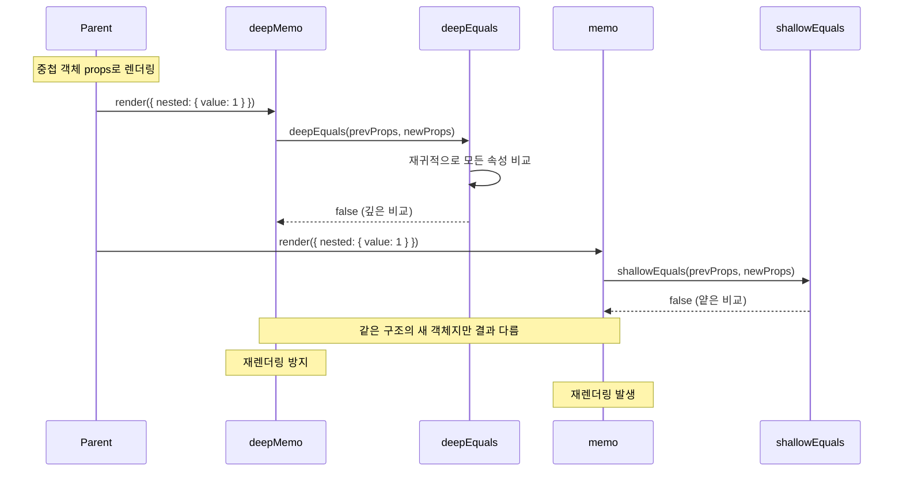
```mermaid
sequenceDiagram
    participant Parent
    participant deepMemo
    participant deepEquals
    participant memo
    participant shallowEquals

    Note over Parent: 중첩 객체 props로 렌더링

    Parent->>deepMemo: render({ nested: { value: 1 } })
    deepMemo->>deepEquals: deepEquals(prevProps, newProps)
    deepEquals->>deepEquals: 재귀적으로 모든 속성 비교
    deepEquals-->>deepMemo: false (깊은 비교)

    Parent->>memo: render({ nested: { value: 1 } })
    memo->>shallowEquals: shallowEquals(prevProps, newProps)
    shallowEquals-->>memo: false (얕은 비교)

    Note over deepMemo,memo: 같은 구조의 새 객체지만 결과 다름
    Note over deepMemo: 재렌더링 방지
    Note over memo: 재렌더링 발생
```

## 8. 스케줄링 플로우

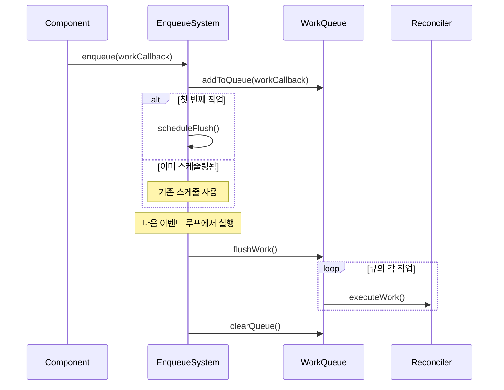
```mermaid
sequenceDiagram
    participant Component
    participant EnqueueSystem
    participant WorkQueue
    participant Reconciler

    Component->>EnqueueSystem: enqueue(workCallback)

    EnqueueSystem->>WorkQueue: addToQueue(workCallback)

    alt 첫 번째 작업
        EnqueueSystem->>EnqueueSystem: scheduleFlush()
    else 이미 스케줄링됨
        Note over EnqueueSystem: 기존 스케줄 사용
    end

    Note over EnqueueSystem: 다음 이벤트 루프에서 실행

    EnqueueSystem->>WorkQueue: flushWork()

    loop 큐의 각 작업
        WorkQueue->>Reconciler: executeWork()
    end

    EnqueueSystem->>WorkQueue: clearQueue()
```

이러한 시퀀스 다이어그램들은 React의 내부 동작 원리를 시각적으로 이해하는 데 도움이 됩니다. 각 단계별로 어떤 함수들이 어떤 순서로 호출되는지, 그리고 상태가 어떻게 관리되는지를 명확하게 보여줍니다.
